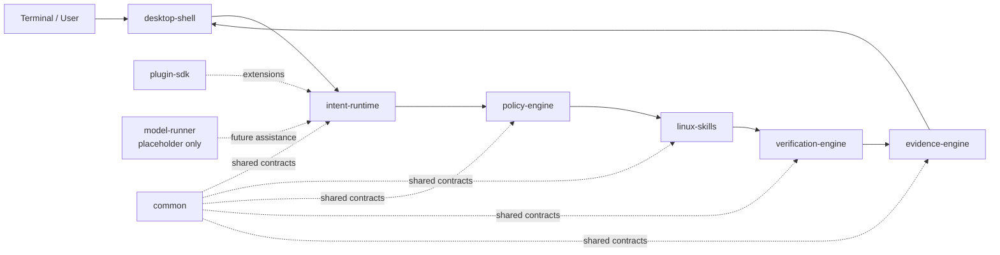
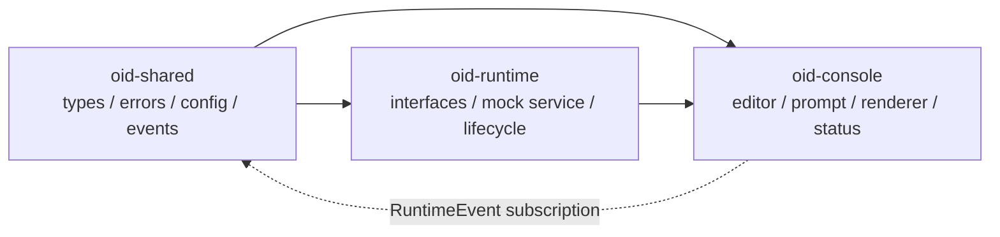
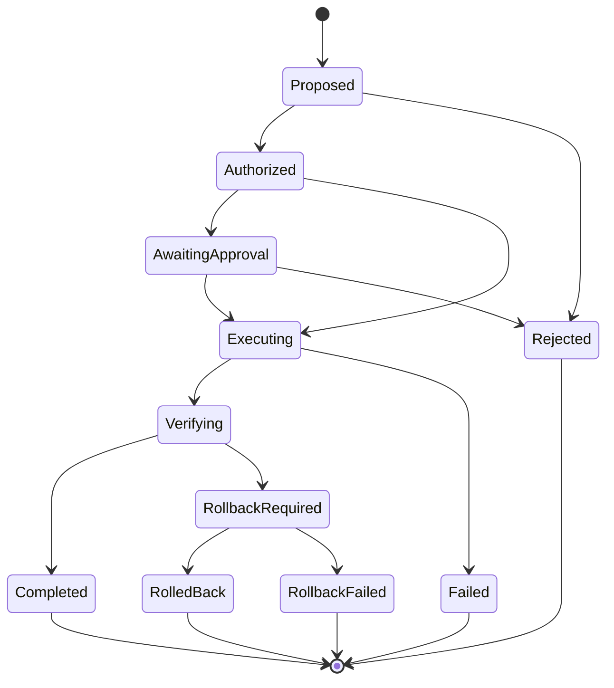

# Architecture

## Purpose

OID is a modular, intent-driven Linux desktop environment. It augments the terminal while keeping the terminal as the primary interface. The system coordinates operations; it does not silently become the operating system or hide actions from the user.

## Initial boundaries

## Phase 2 Runtime and Console boundaries

The Phase 2 reference client keeps the three new boundaries acyclic:

`oid-runtime` publishes lifecycle and command events through the lightweight
shared event bus. `oid-console` subscribes and derives adaptive prompt presence
from events; it does not directly manipulate runtime state or animation state.
The mock runtime supplies deterministic health, backend, model, and memory
values until real services are introduced.

The interactive console uses a standard-library terminal input boundary. TTY
sessions use raw key input for editing and history navigation; non-TTY sessions
fall back to line-oriented input so tests and pipelines do not hang. The
renderer redraws the current line and status bar using terminal-safe ANSI
operations. Model inference, llama.cpp, hardware probing, and Linux operations
remain outside this milestone.

## Responsibilities

- `common` contains only genuinely cross-cutting types and infrastructure contracts.
- `intent-runtime` owns intent identity, lifecycle, and state transitions; it does not execute Linux operations.
- `linux-skills` exposes typed, capability-oriented operation contracts; concrete adapters will remain explicit.
- `policy-engine` decides whether an operation is permitted and whether user approval is required.
- `verification-engine` validates postconditions, health, and rollback outcomes.
- `evidence-engine` records plans, approvals, execution results, verification, and history.
- `plugin-sdk` defines extension contracts without coupling the core to plugin implementations.
- `model-runner` is reserved for future optimized model interfaces and contains no AI implementation in this phase.
- `desktop-shell` integrates with terminal and desktop surfaces; Wayland, D-Bus, and systemd adapters will be isolated behind interfaces.

## Dependency rules

Dependencies point toward contracts and stable inner boundaries. Execution adapters must not own policy decisions, and model assistance must not bypass authorization or evidence recording. Cross-crate dependencies should be introduced only when a type is truly shared.

## Operation lifecycle

This is a target lifecycle, not implemented business logic. State transitions must be explicit, auditable, and testable.

## Non-functional constraints

Rust is the primary implementation language. The project targets async-friendly, testable components; forbids unsafe code unless a future, documented exception is accepted; favors minimal dependencies; and requires user-visible plans, rationale, changes, and undo information for system actions.
