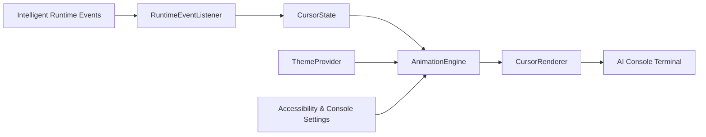
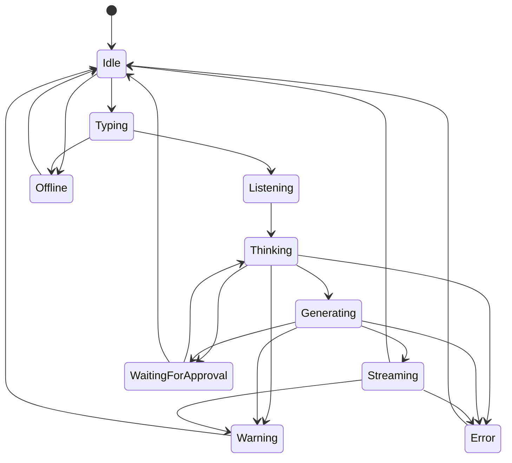

# WP-0017: Adaptive Presence Indicator

## Status

Proposed

The implementation vocabulary is an adaptive presence indicator rendered as
the prompt cursor. The broader cursor theme and plugin design in this WP
remains future-facing.

## Purpose

Design a terminal cursor that visually communicates the state of the Intelligent Runtime. The cursor is part of the AI Console interface and acts as a lightweight status indicator; it is not decorative animation.

The design draws from classic DOS ANSI terminals, VT-era consoles, and retro computing while adapting those ideas for an AI-native, streaming console.

## Scope

This WP defines the cursor state model, runtime-event mapping, rendering boundary, animation principles, theme model, accessibility behavior, and future plugin extension points.

The design covers a rectangular or block-oriented cursor that can change width, pulse, scan, breathe, brightness, opacity, and theme-defined color. It does not define a general-purpose animation framework, avatar, orb, spinner, chat bubble, or GUI widget system.

## Architecture

### Components

| Component | Responsibility | Boundary rule |
| --- | --- | --- |
| `CursorState` | Represents the semantic runtime state and relevant metadata | Contains no rendering or timing logic |
| `RuntimeEventListener` | Converts runtime events into cursor-state transitions | Reacts only to published Runtime Events |
| `AnimationEngine` | Produces time-based frames within state and accessibility constraints | Cannot invent runtime state or perform runtime actions |
| `ThemeProvider` | Supplies shape, color, timing, and animation policy for a selected theme | Must expose a stable, versioned theme contract |
| `CursorRenderer` | Draws the current frame in the terminal renderer | Does not directly inspect runtime internals |

The console must not directly manipulate animations in response to internal application conditions. It subscribes to runtime events, updates `CursorState`, and passes state through the animation and rendering boundaries.

## Cursor state model

`CursorState` should represent at least:

- semantic state
- transition timestamp or monotonic sequence
- optional request/run correlation ID
- accessibility mode, including reduced motion
- selected theme identifier
- whether the cursor is currently visible

The state model should remain backend-neutral. It may carry a short reason or label for diagnostics, but it must not expose backend-specific objects or inference internals.

## State diagram

The diagram describes semantic transitions, not mandatory animation transitions. A renderer may use a short transition or settle immediately when reduced motion is enabled.

## Runtime event mapping

| Runtime event or condition | Cursor state | Suggested visual vocabulary |
| --- | --- | --- |
| Console ready; no active input | `Idle` | Stable block or rectangle; calm blink or no motion |
| Key input is being edited | `Typing` | Normal insertion cursor; restrained width response |
| Input is being collected or command is being interpreted | `Listening` | Slight pulse or softened brightness |
| Request accepted; runtime is planning or selecting resources | `Thinking` | Slow breathing or subtle scan |
| Backend has begun producing output | `Generating` | Gradual width or brightness change |
| Output tokens/events are arriving | `Streaming` | Small rhythmic width/scan response tied to stream cadence, rate-limited |
| User approval is required | `WaitingForApproval` | Stable attention cue; no spinner; theme-defined caution color |
| Non-fatal degradation or recoverable issue | `Warning` | Distinct but restrained brightness/color treatment |
| Request or runtime error | `Error` | Clear static error treatment; avoid persistent flashing |
| Runtime or required backend is unavailable | `Offline` | Muted or hollow cursor with a stable offline indication |

Visual behavior is theme-defined, but semantic meaning must remain consistent across themes. Color alone must never be the only distinction for warning, error, approval, or offline states.

## Animation principles

- Keep motion subtle, sparse, and low CPU.
- Do not use spinning icons, bouncing objects, chat bubbles, or separate loading ornaments.
- Let the cursor itself communicate the state.
- Prefer width, pulse, scan, breathing, brightness, opacity, and theme-dependent color changes.
- Use monotonic timing and bounded frame rates; do not tie rendering to token frequency without rate limiting.
- Avoid visual noise during long streams and avoid animation that competes with readable output.
- Preserve terminal correctness: cursor updates must not corrupt streamed text, prompt history, selection, or resize handling.
- Respect reduced-motion settings by disabling continuous motion and using static shape, width, brightness, or text/status cues.
- Provide sufficient contrast and a non-color fallback for every semantic state.

## Theme model

Themes should be data-driven and versioned. A future theme manifest may define:

- theme ID and display name
- cursor shape and width range
- palette or semantic color mapping
- animation mode per `CursorState`
- timing, pulse, scan, and opacity parameters
- reduced-motion fallback
- contrast and terminal capability requirements

Theme parameters control presentation only; they cannot change runtime state semantics, authorization, event handling, or command behavior.

### Planned themes

- **Classic DOS ANSI:** block cursor and classic 16-color palette.
- **Green CRT:** green phosphor treatment with restrained scan/breathing behavior.
- **Amber CRT:** warm amber text and cursor glow.
- **KITT-inspired:** horizontal scanning treatment with carefully bounded motion.
- **Modern:** clean, minimal cursor with very low animation.
- **Matrix:** green terminal aesthetic with accessible static fallback.
- **Developer:** information-dense but quiet state distinctions for long coding sessions.
- **High Contrast:** strong shape and brightness distinctions with motion disabled by default.

## Future plugin support

Third-party cursor themes may be loaded through a stable, versioned theme interface. A plugin should provide declarative theme metadata and rendering parameters rather than arbitrary code in the console process.

The future extension boundary should define:

- manifest version and compatibility range
- theme identity and author metadata
- allowed shape, palette, timing, and animation primitives
- resource limits for frame rate and update frequency
- trust, signing, installation, enablement, and removal
- safe fallback when a theme is invalid, incompatible, or revoked

Untrusted themes must not receive runtime control, filesystem access, credentials, or arbitrary terminal escape-sequence authority.

## Deliverables

- Cursor architecture and component responsibility document.
- State model and state diagram for all runtime-facing states.
- Runtime event-to-cursor mapping table.
- Theme manifest and rendering model proposal.
- Accessibility and reduced-motion behavior specification.
- Future plugin interface and trust-boundary proposal.
- Example static and animated treatments for each planned theme, as design references only.

## Acceptance Criteria

- All ten required runtime states have documented semantics and event mappings.
- The cursor reacts only to Runtime Events through `RuntimeEventListener`.
- `CursorState`, `CursorRenderer`, `AnimationEngine`, and `ThemeProvider` responsibilities are separable and testable.
- The design excludes spinners, chat bubbles, and decorative animation as primary status mechanisms.
- Reduced-motion, contrast, color-independent meaning, low CPU, and terminal capability behavior are documented.
- Theme parameters cannot alter runtime semantics or bypass security boundaries.
- Third-party theme support has a stable interface direction and explicit trust constraints.

## Dependencies

WP-0002, WP-0006, WP-0009, WP-0010; ADR-0004, ADR-0006, ADR-0007, ADR-0008.

## Future Work

Validate the design with terminal capability matrices, accessibility review, real streaming workloads, performance measurements, theme prototypes, remote console behavior, and plugin security review. Implementation should follow only after the event contract and console renderer lifecycle are stable.
