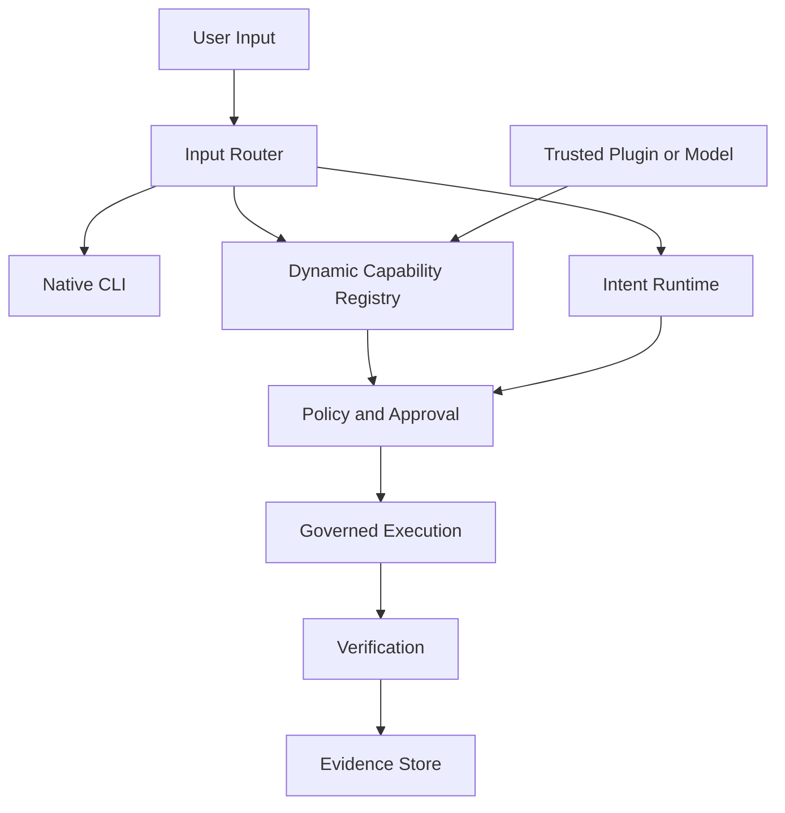

# WP-0037: Dynamic CLI Capability Framework

## Status

Backlog — high priority, after the terminal foundation.

## Epic

OID Terminal

## Purpose

Extend the Unix command line with discoverable, capability-based commands while
preserving compatibility with native Linux CLIs. OID must augment the terminal,
not replace it.

## User experience

The terminal uses one prompt with three interaction modes:

```text
$ git status                 -> Native CLI
$ postgres diagnose          -> Dynamic CLI capability
$ cluster status             -> Dynamic CLI capability
$ fix why PostgreSQL won't start
                              -> Intent Mode
                              -> Operation Plan
                              -> postgres diagnose
```

## Requirements

- Execute existing Linux commands unchanged through the native executable path.
- Discover and register capability commands when a trusted plugin or model exposes them.
- Allow capabilities to register and unregister commands at runtime.
- Expose loaded capability commands through `help`, command discovery, and shell completion.
- Route input through the appropriate native CLI, dynamic capability, or intent path.
- Permit intent resolution to select a dynamic command when policy and capability matching allow it.
- Record dynamic command planning, authorization, execution, verification, and evidence.
- Keep dynamic commands subject to the same policy, approval, rollback, and evidence boundaries as other operations.
- Prevent a plugin or model from shadowing native commands without an explicit, visible policy decision.

## Target architecture



## Planned components

- `InputRouter`: classify native, dynamic, and intent input without breaking shell compatibility.
- `CapabilityRegistry`: register, unregister, discover, version, and resolve command capabilities.
- `CommandDescriptor`: expose command name, syntax, description, completion metadata, ownership, and required permissions.
- `NativeExecutor`: preserve argument and environment semantics for existing executables.
- `DynamicExecutor`: invoke a registered capability through a governed skill boundary.
- `CompletionProvider`: merge native shell completion with currently loaded capability commands.
- `IntentResolver`: map natural-language goals to plans and, when appropriate, dynamic capabilities.
- `CapabilityEvidence`: record which capability, version, provider, policy decision, and verification result handled an execution.

## Security constraints

- Only trusted, authorized providers may register capabilities.
- Registration must declare permissions, mutability, side effects, rollback support, and ownership.
- Capability removal must prevent new invocations while allowing in-flight operations to reach a recorded terminal state.
- Native command resolution must remain deterministic and visible.
- Dynamic commands must not silently intercept native executable names.
- Model suggestions are proposals; they never bypass routing, policy, approval, or evidence.

## Acceptance criteria

- Native Linux commands continue to behave exactly as they do today.
- Capability commands appear only while their capability is loaded and authorized.
- Dynamic commands support help and shell completion metadata.
- Capabilities can register and unregister at runtime.
- Intent mode can invoke a dynamic capability when the resolver selects it and policy permits it.
- Native, dynamic, and intent executions produce structured evidence and verification records.
- Command collisions and unavailable capabilities produce explicit, user-visible outcomes.
- The router, registry, completion provider, and execution boundaries have isolated unit and integration tests.

## Dependencies

WP-0006, WP-0007, WP-0010, WP-0018, WP-0022, WP-0023, WP-0031, and the `plugin-sdk` and `desktop-shell` contracts.

## Future work

Capability signing, revocation, isolation, remote capability providers, richer
natural-language resolution, and Open Intelligence Platform integration.

