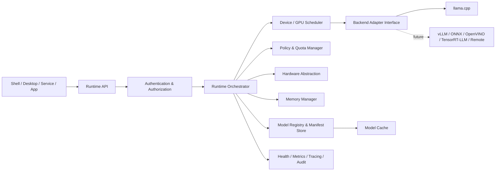
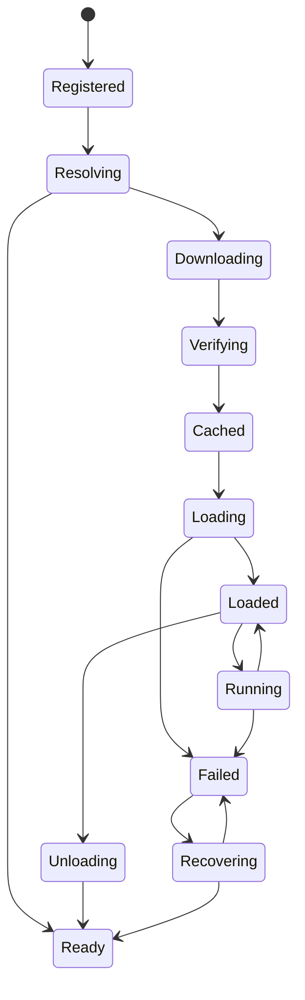

# Intelligent Runtime Architecture

## Architecture overview

The runtime is a control plane that turns model requests into policy-checked, resource-aware backend sessions. Callers submit intent through a stable API; they do not select backend-specific objects or manage device memory directly.

The runtime should be usable in-process for local consumers and as a local service over a Unix socket. An optional TCP endpoint may be added for controlled multi-process or enterprise deployments.

## Phase 4 runtime services

The runtime foundation now separates four service concerns:

- `BackendManager` owns backend registration, enable/disable state, active selection, and health.
- `ModelRegistry` owns persistent model metadata; it does not download, parse, load, or infer models.
- `HardwareService` owns normalized CPU, memory, operating-system, architecture, and SIMD discovery, with GPU/NPU placeholders.
- `RuntimeService` is the client-facing read/query boundary consumed by the AI Console.

The runtime owns the composition root and registers `LlamaCppAdapter` through
the common `Backend` contract. The `oid-llama-cpp-adapter` package re-exports
that stable runtime boundary for future plugin loading; the console never
constructs or accesses a concrete adapter. The `oid-llama-cpp-sys` crate is the
only unsafe boundary and links directly to `libllama` when configured.

### Native API boundary

The adapter calls `llama_backend_init`, `llama_backend_free`,
`llama_print_system_info`, `llama_model_load_from_file`, `llama_model_free`,
`llama_model_size`, and `llama_tokenize`. The public runtime exposes only
descriptors, health, model lifecycle results, and token counts. No llama.cpp
pointer, context, sampler, GGUF parser, or inference operation crosses the
runtime API.

### Model discovery and lifecycle

`ModelDiscovery` recursively scans configured directories for case-insensitive
`.gguf` files and registers metadata without opening a model. Defaults are
`~/.local/share/intelligent-runtime/models`, `~/Models`, and `./models`.

The initial loader admits one model. It publishes `ModelLoading`, transitions
metadata to `Loading`, calls the active backend, records backend-reported
memory, then publishes `ModelLoaded`. Failure records `Failed` and emits an
error event. Unload follows the corresponding `ModelUnloading` and
`ModelUnloaded` path.

## Module responsibilities

| Module | Responsibility | Must not own |
| --- | --- | --- |
| API boundary | Versioned request, response, streaming, and error contracts | Backend or device details |
| Orchestrator | Model lifecycle, request coordination, and run state | Tensor operations |
| Model registry | Model identity, manifests, versions, sources, and trust metadata | Download implementation policy decisions |
| Model cache | Verified artifact storage, eviction, and integrity state | Model parsing |
| Hardware abstraction | CPU/GPU/NPU discovery, capabilities, and health | Vendor-specific scheduling policy |
| Memory manager | Reservations, budgets, accounting, and pressure signals | Allocating tensors inside a backend |
| Scheduler | Placement, concurrency, priority, and device admission | Inference mathematics |
| Quantization policy | Selects an allowed model variant for hardware and policy | Quantizing model files |
| Backend adapters | Map common runtime operations to backend capabilities | General runtime policy |
| Security layer | Authentication, authorization, quotas, and isolation decisions | Model quality decisions |
| Observability | Metrics, traces, audit events, and health reports | Mutating runtime state without an authorized command |
| CLI/client | Human-facing command translation and presentation | Owning runtime state |

## Core lifecycle

A model artifact must be verified before it becomes loadable. A run must be admitted only after authorization, quota, context, memory, hardware, and backend capability checks. Idle unloading is an optimization and must never invalidate an active stream.

## Backend boundary

The common adapter contract should cover discovery, capability reporting, load/unload, run admission, cancellation, streaming output, health, and structured errors. Adapters translate runtime concepts into backend-specific calls; they do not expose backend handles through the public API.

Initial adapter: `llama.cpp`.

Planned adapters: vLLM, ONNX Runtime, OpenVINO, TensorRT-LLM, Ollama, Docker Model Runner, and remote OpenAI-compatible providers.

## Security and trust

Model sources, downloaded bytes, manifests, and runtime actions are separately auditable. SHA256 verification is the minimum integrity check for cached artifacts. Authentication identifies the caller; authorization determines which models, devices, capabilities, and resource budgets that caller may use. Remote providers require explicit endpoint and credential policy and must not be treated as local devices.

## Design principles

- Backend neutrality: callers depend on runtime capabilities, not engine APIs.
- Hardware awareness: placement and model variant selection use discovered capabilities and live health.
- Explicit policy: no model load, run, download, or backend enablement bypasses authorization.
- Recoverability: lifecycle transitions, failures, and recovery decisions are observable.
- Composable transport: Unix socket first; optional TCP and TLS later.
- Stable contracts: API versioning and capability negotiation precede backend expansion.
- Minimal core: no tokenizer, parser, tensor, kernel, or inference implementation in this module.
